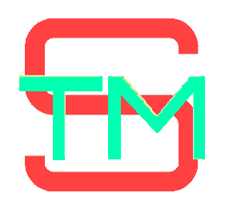

# See The Molecule new generation (STMng)

    

See The Molecule new generation (STMng) is a chemical and crystallographic structures visualization and analysis tool that implements some of the functionalities of the old [STM4](http://mariovalle.name/STM4/index.html) visualization tool.

STMng primary use is to analyze the results of the [USPEX](https://uspex-team.org/) computational material discovery system but it is useful also as a general crystallographic visualization tool.

### First a quick remainder
Similarly to what Richard Hamming — of the “Numerical methods for scientists and engineers” fame — said in 1962: *“The purpose of computing is insight, not numbers”,* for every visualization tool we should remember that: *“The purpose of visualization is insight, not images”.*

So, remember: goal of STMng is to help your understanding, not to provide fancy images only!

### Highlights
- Unlike its predecessor, STMng is built on top of open source framework and libraries.
- STMng is multiplatform: currently available for Windows and Linux, for Apple, I need help.
- The tool is stable and used in actual research. This repository, instead, is under development 🚧.
- STMng could read for analysis and visualization various file formats.
- The available computational function (called nodes) could be combined in user defined projects.
- The resulting visualization could be captured as images, movies and STL files.
- STMng can match your loaded structure to a collection of prototypes.
- You can perform fingerprint computation and analysis of a set of loaded structures.

## Documentation

A quick video tutorial [is available](https://www.youtube.com/watch?v=2t7hD9XwINQ).

You can access the documentation from within STMng with the F1 key. Specifically, you can access the documentation of the selected node by pushing Ctrl-F1. As soon as I understand how to create GitHub pages, I will put also this documentation online.

## Installation
### Windows (Windows 11)
- Download STMng-*\<version\>*-setup.exe
- Execute it as Administrator
- Select an installation directory (normally: "C:\Program Files\STMng")
- Run STMng from the start menu

### Linux (Ubuntu 22)
- Download STMng-*\<version\>*.AppImage
- Verify you have the package **fuse** installed
- Install **SPGlib** shared libraries (see [How to install spglib C-API](https://spglib.readthedocs.io/en/latest/install.html))
- chmod a+x ./STMng-*\<version\>*.AppImage
- Run ./STMng-*\<version\>*.AppImage\
  Sometimes this step fails with: “The SUID sandbox helper binary was found, but is not configured correctly. Rather than run without sandboxing I'm aborting now. You need to make sure that /tmp/.mount_STMng-*nnnn*/chrome-sandbox is owned by root and has mode 4755.” so do what suggested.

## Contribute

We appreciate all feedback you can provide. So, use STMng and provide feedback and ideas that could help your research through the use of this tool.

For example you could send:
- Bugs, obviously, with something to reproduce them
- Functionalities you would like to see added
- File formats you need to read or write
- Suggestions for better name and icon!

and, time and resources permitting, we will try to implement your inputs.

In exchange please mention STMng in your publications.

## Implementation & development

**STMng** is an [ElectronJS](https://www.electronjs.org/) multiplatform application written in [Typescript](https://www.typescriptlang.org/) with small interface parts written in [C++](https://isocpp.org/).

The user interface is based on the [Vue](https://vuejs.org/) framework and is done using the [Vuetify](https://vuetifyjs.com/en/) widgets.

The 3D viewer uses the [three.js](https://threejs.org/) interface to WebGL provided by the Chromium browser integrated inside ElectronJS.

The development toolchain is based on [Vite](https://vite.dev/), the final build for production is done by [electron-builder](https://www.electron.build/). The bundling of the code for the parallel computations is done by [Rolldown](https://rolldown.rs/).

Credits for specific libraries used are listed in the respective node documentation pages.

## Build from sources
- Build on Windows: [instructions](BUILD-Windows.md)
- Build on Linux: [instructions](BUILD-Linux.md)
